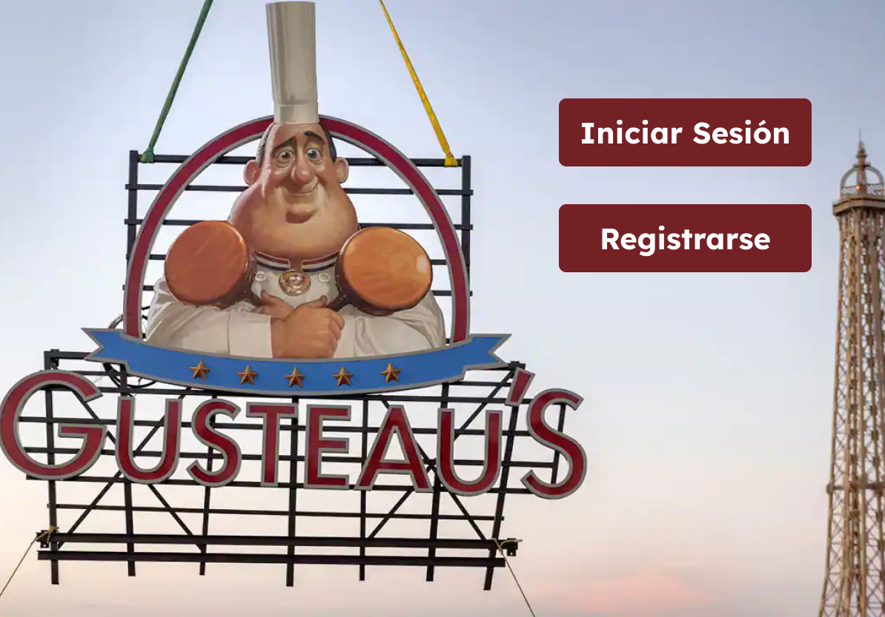
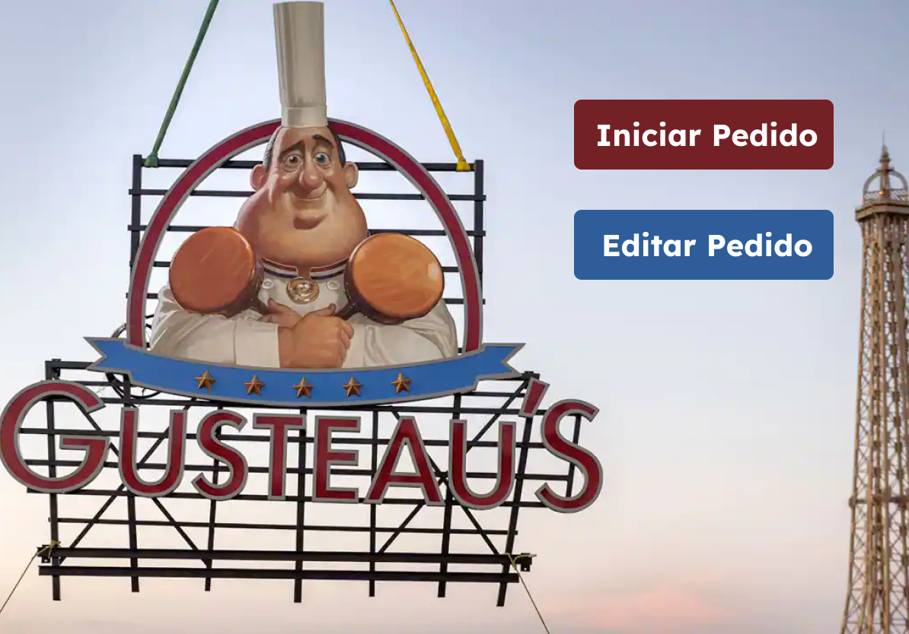
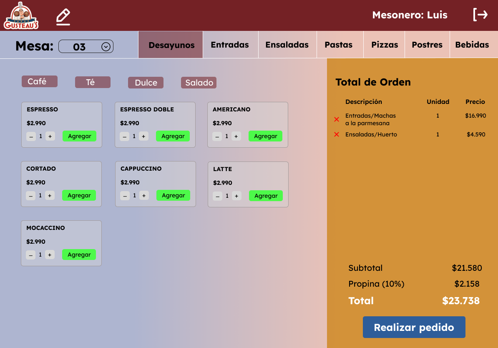
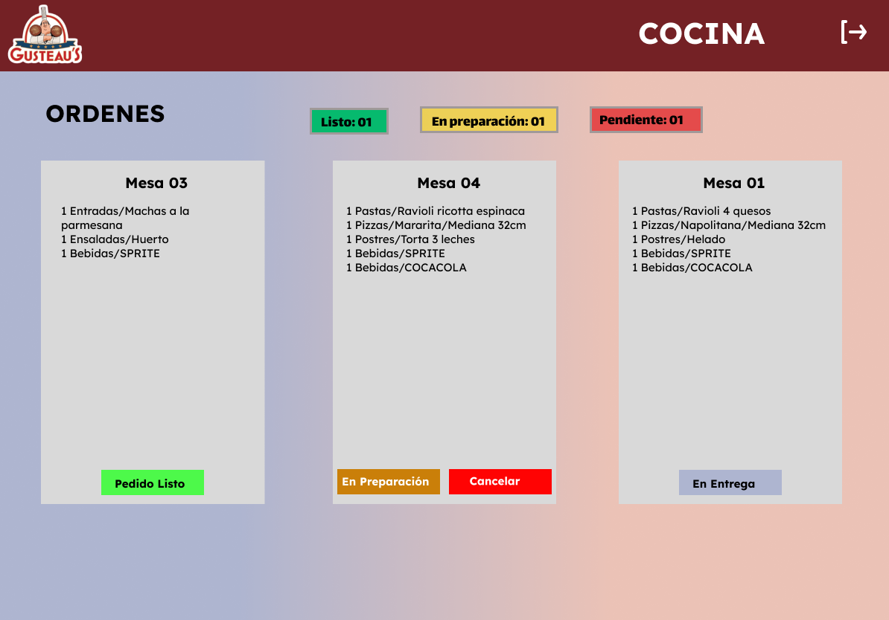
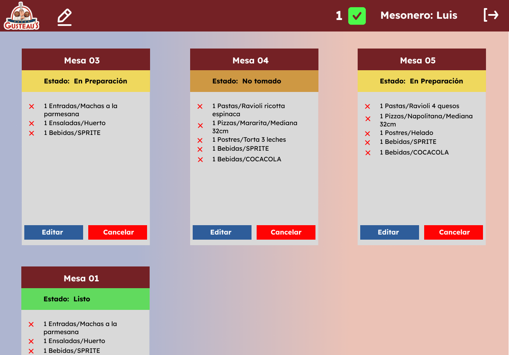
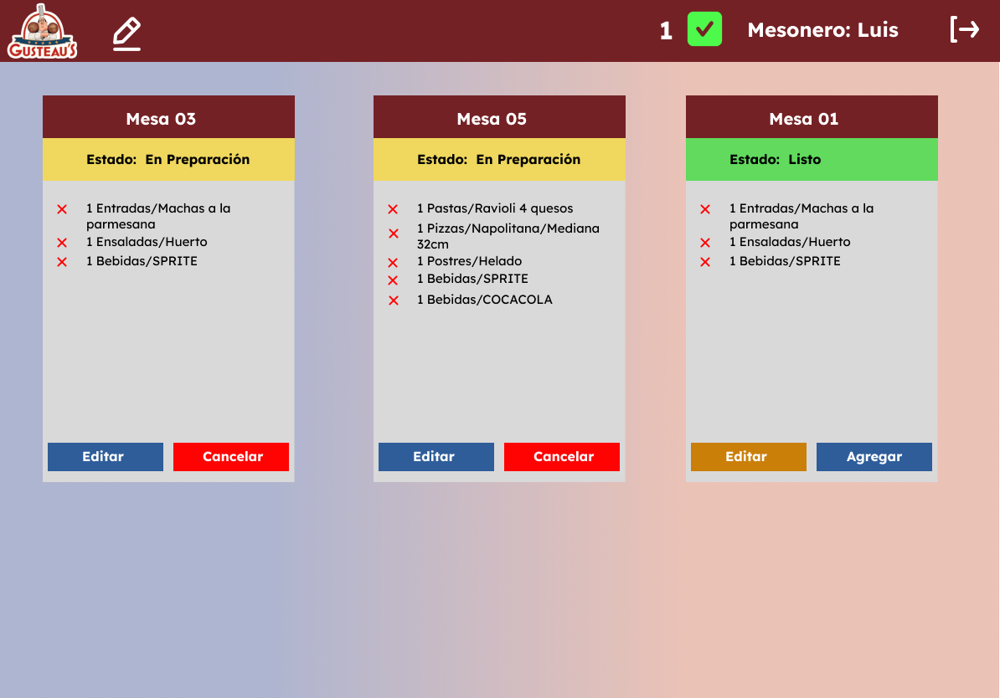
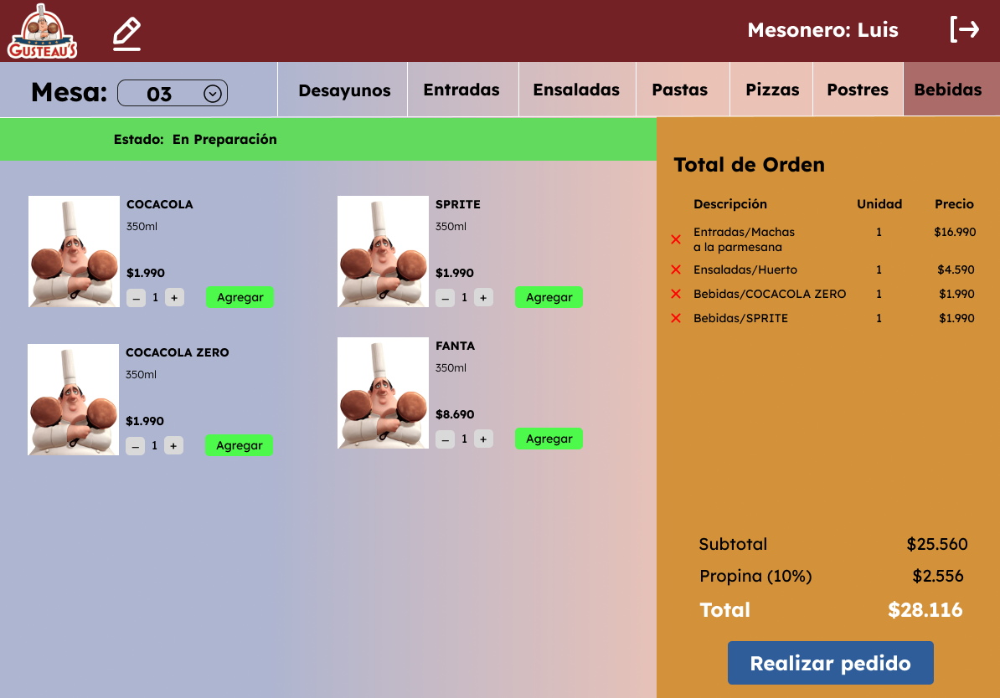

# GUSTEAUS RESTAURANT

*   [1. About](#1-about)
*   [2. Prototipos](#2-prototipos)
*   [3. Funcionalidad](#3-funcionalidad)
*   [4. Herramientas Utilizadas](#4-herramientas-utilizadas)
*   [5. Demo](#5-demo)

***

## 1. About

 Gusteaus Restaurant APP, es una interfaz que permite tomar pedidos usando una tablet y enviarlos a cocina para que se preparen de manera ordenada y eficientemente. Es por ello que la aplicación cuenta con una vista de login para  el empleado, una pantalla de toma de pedidos dónde se podrá editar y añadir items a la orden, junto con el número de la mesa; así como también una pantalla de cocina donde se podrán ver todos los pedidos y seleccionar el estado de cada uno de estos. 
 
-----------------------------

## 2. Prototipo

-------------------------------------------
## 3. Funcionalidad
En el siguiente [enlace](https://www.figma.com/proto/DNCsmQCBFB2WIWBtwaGmWX/Gusteau's-Restaurant?node-id=1%3A2&scaling=scale-down&page-id=0%3A1&starting-point-node-id=1%3A2&show-proto-sidebar=1) puede ver la funcionalidad 

----------------------------
## 4. Herramientas utilizadas

----------------------------
## 5. Demo

[//]: # "Puedes probar la demo final ✨[aquí]()✨"